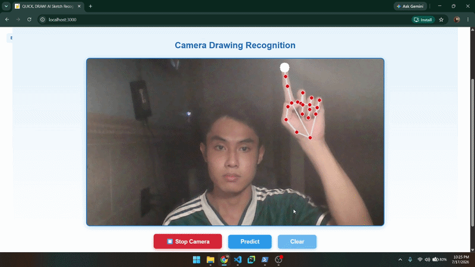

# Hand Drawing Recognition System

## Overview

Hand Drawing Recognition System is a web-based application that allows users to draw simple sketches on a digital canvas and receive real-time predictions from a deep learning model.

The system integrates a React frontend, a Django REST API backend, and a custom Convolutional Neural Network (CNN) built with PyTorch. Users can also submit feedback when the prediction is incorrect, helping improve future versions of the model.


## Features

* Draw objects directly on an interactive canvas
* Real-time image classification
* Confidence score display
* Inference time measurement
* Feedback collection system
* Camera-based drawing recognition
* Responsive web interface

## Demo

<p align="center">
  
  
</p>

## Technology Stack

### Frontend

* React
* JavaScript
* Framer Motion

### Backend

* Django
* Django REST Framework

### Deep Learning

* PyTorch
* OpenCV
* NumPy
* Pillow

### Database

* SQLite


## Dataset Classes

The model is trained to recognize the following 25 classes:

* ["Apple", "Bowtie", "Circle", "Cloud", "Cup",
  "Diamond", "Fish", "Guitar", "Hat", "Headphones",
  "Ladder", "Laptop", "Leaf", "Moon", "Pants",
  "Pencil", "Smiley Face", "Soccer Ball", "Sock",
  "Star", "Sun", "T-Shirt", "Triangle",
  "Watermelon", "Wine Glass"]


# Model Architecture

The recognition model is a custom CNN architecture enhanced with residual (skip) connections.

<image src="./train_model/architecture/architecture.png" alt="Architecture" width="600"/>

## Model Summary

| Layer       | Output Size  |
| ----------- | ------------ |
| Input       | 3 × 64 × 64  |
| CNN Block 1 | 32 × 32 × 32 |
| CNN Block 2 | 64 × 16 × 16 |
| CNN Block 3 | 128 × 8 × 8  |
| Flatten     | 8192         |
| FC1         | 512          |
| FC2         | 256          |
| Output      | Num classes  |


## Project Structure

```text
project/
│
├── frontend/
│   ├── src/
│   └── public/
│
├── backend/
│   ├── src
│   │   ├── config/
│   │   ├── recognition/
│   │   ├── ai_engine/
│   │   │   ├── model_weights/
│   │   │   ├── model_architecture.py
│   │   │   ├── camera_service.py
│   │   │   ├── cnn_model.py
│   │   │   └── preprocess.py
│   │   │
│   │   ├── manage.py
│   │   └── db.sqlite3
│
└── README.md
```


## Installation

### Clone Repository

```bash
git clone https://github.com/luannt1010/real-time-sketch-recognition.git
cd real-time-sketch-recognition
```

### Create virtual environment:

```bash
python -m venv venv
```

### Activate environment:

Windows:

```bash
venv\Scripts\activate
```

Linux / MacOS:

```bash
source venv/bin/activate
```

### Install dependencies:

```bash
pip install -r requirements.txt
```

### Train Model 
If you dont have the model weght for running wed app, u can train model with default command that I used:

```bash
cd train_model
python .\train.py --num_workers 4 --pin_memory True
```

### Training Arguments

| Argument        | Type    |       Default | Description            |
| --------------- | ------- | ------------: | ---------------------- |
| `--root_dir`    | `str`   |     `dataset` | Dataset directory      |
| `--save_path`   | `str`   | `checkpoints` | Checkpoint directory   |
| `--batch_size`  | `int`   |          `32` | Batch size             |
| `--num_workers` | `int`   |           `0` | Data loading workers   |
| `--epochs`      | `int`   |          `30` | Number of epochs       |
| `--val_factor`  | `float` |         `0.1` | Validation split ratio |
| `--test_factor` | `float` |         `0.1` | Test split ratio       |
| `--lr`          | `float` |       `0.001` | Learning rate          |
| `--dropout`     | `float` |         `0.3` | Dropout rate           |
| `--pin_memory`  | `bool`  |       `False` | Enable pinned memory   |

Training results: 
<image src="./train_model/checkpoints/metrics_report.png" alt="Architecture" width="600"/>

Testing results:

| Metric    |  Score |
| --------- | -----: |
| Precision | 0.9002 |
| Recall    | 0.8993 |
| F1-score  | 0.8986 |
| Accuracy  | 0.9016 |


**When u done in training model, u have to place path of weight at backend\src\ai_engine\cnn_model.py**


## Backend Setup

Navigate to backend folder:

```bash
cd .\backend\src
```

Run Django server:

```bash
python manage.py runserver
```

Backend will be available at:

```text
http://localhost:8000
```


## Frontend Setup

Navigate to frontend folder:

```bash
cd frontend
```

Install dependencies:

```bash
npm install
```

Run wed app:

```bash
npm start
```

Frontend will be available at:

```text
http://localhost:5173
```


